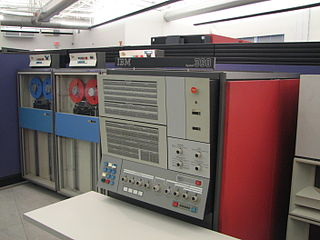

# Awesome Mainframes  <!-- omit in toc -->

Awesome list of mainframe related resources &amp; projects.  

The target audience of this list are those that are interested in learning about mainframes with emphasis on the System/360 and it's descendants.

If you would like to contribute to this list, please submit a pull request.  If you are not familiar with git pull request and want to just submit a minor correction or a new link, just open an "issue" in github.  This will ensure that any submissions are not overlooked.

This list is licensed under [CC0](https://creativecommons.org/publicdomain/zero/1.0/).

# Contents <!-- omit in toc -->
- [IBM System/360, System/370, System/390, z Mainframes](#ibm-system360-system370-system390-z-mainframes)
  - [Getting Started](#getting-started)
  - [General](#general)
  - [Emulators](#emulators)
  - [Hercules GUI Front Ends](#hercules-gui-front-ends)
  - [TN3270 Terminal Emulators](#tn3270-terminal-emulators)
    - [TN3270/3270 Technical Information](#tn32703270-technical-information)
  - [Operating Systems](#operating-systems)
    - [MVS](#mvs)
      - [MVS Information](#mvs-information)
      - [MVS Videos](#mvs-videos)
    - [VM/370](#vm370)
      - [VM/370 Videos](#vm370-videos)
    - [MUSIC/SP](#musicsp)
    - [Michigan Terminal System](#michigan-terminal-system)
    - [Linux](#linux)
    - [DOS/360](#dos360)
    - [DOS/VS](#dosvs)
    - [OS/360 MFT](#os360-mft)
    - [OS/360 MVT](#os360-mvt)
    - [TSS/370](#tss370)
  - [CICS](#cics)
  - [Programming Languages](#programming-languages)
    - [APL](#apl)
    - [Assembler](#assembler)
      - [Assembler Tutorials / Courses](#assembler-tutorials--courses)
    - [BASIC](#basic)
    - [C](#c)
    - [CLIST](#clist)
    - [COBOL](#cobol)
      - [COBOL Tutorials / Courses](#cobol-tutorials--courses)
      - [COBOL Videos](#cobol-videos)
    - [JCL](#jcl)
    - [REXX](#rexx)
      - [REXX Tutorials / Courses](#rexx-tutorials--courses)
  - [Mainframe Related YouTube Channels](#mainframe-related-youtube-channels)
  - [HNET / BITNET](#hnet--bitnet)
    - [HNET / BITNET Videos](#hnet--bitnet-videos)
  - [Mainframe Blogs](#mainframe-blogs)
  - [Courses](#courses)
  - [Free or Opensource Software to run on your Mainframe](#free-or-opensource-software-to-run-on-your-mainframe)
  - [Other lists of links](#other-lists-of-links)
  - [Communities / Forums / Mailing Lists](#communities--forums--mailing-lists)
    - [groups.io](#groupsio)
  - [Others / Yet to be categorized](#others--yet-to-be-categorized)
- [Other IBM Mainframes (IBM 1401, 1620, 7090/7094, System 3)](#other-ibm-mainframes-ibm-1401-1620-70907094-system-3)
  - [Emulators](#emulators-1)
  - [Software](#software)

# IBM System/360, System/370, System/390, z Mainframes

## Getting Started

## General
* [OS Timeline](https://webfiles.uci.edu/scosel/_$OSTL37.5.pdf) - "IBM Mainframe Operating Systems: Timeline and Brief Explanation For the IBM System/360 and Beyond" by Dave Morton. Alternate link: https://groups.io/g/hercules-os380/files/_$OSTL37.5.pdf ***NOTE:** You will need to join the [hercules-os380](https://groups.io/g/hercules-os380/) group before you will be able to access this document from the alternate link.*
* [Original System/360 Mainframe Advertisement](http://www.ljw.me.uk/ibm360/nix/360a.html) Historically significant, as it is the original marketing adervertisment for the first System/360 mainframe.
* [The Open Mainframe Project](https://www.openmainframeproject.org/) - *"The Open Mainframe Project is intended to serve as a focal point for deployment and use of Linux and Open Source in a mainframe computing environment. The Project intends to increase collaboration across the mainframe community and to develop shared tool sets and resources. Furthermore, the Project seeks to involve the participation of academic institutions to assist in teaching and educating the mainframe engineers and developers of tomorrow."*
* [Collection of IBM Mainframe Progamming Quick References](http://ibmmainframes.com/references/)

## Emulators
* [Hercules Spinhawk](https://github.com/rbowler/spinhawk) - Hercules 3.x - spinhawk is the repository for the production-quality version (release 3.xx) of the Hercules mainframe virtualization platform
* [Hercules Hyperion](https://github.com/hercules-390/hyperion) - The Hyperion version of Hercules is the official development version of the Hercules emulator and contains the latest bleeding edge changes made by Hercules developers to address various bugs that may exist in the production version.
* [SDL Hercules Hyperion](http://www.softdevlabs.com/hyperion.html) - [(github)](https://github.com/SDL-Hercules-390/hyperion) SoftDevLabs (SDL) version of Hercules 4.x 
  * [Installing SDL Hyperion](https://geronimo370.nl/s370/hercules-installing/installing-sdl-hyperion/) - Gerrard Wassink's tutorial for compiling and installing SDL Hercules Hyperion on various architectures.
  * [Build your latest version of Hercules from source - M82](https://www.youtube.com/watch?v=ZJI5v3-zEww&feature=youtu.be) (YOUTUBE) - Video from [Moshix](https://github.com/moshix) demonstrating building the latest version of Hercules from source code.

## Hercules GUI Front Ends
* [HercGUI](http://softdevlabs.com/hercgui.html) - *"HercGUI The Hercules graphical user interface for Windows is a standard Windows program that makes using the Hercules emulator much easier and more enjoyable. It automatically maintains your Hercules configuration and log files by means of standard Windows dialogs and provides realistic real-time feedback of your virtual mainframe's activity."*  From Software Development Laboratories.
* [HercStudio](http://hercstudio.sourceforge.net) - Hercules Studio is a GUI front-end to the Hercules mainframe Emulator on Mac and Linux.  Written by Jacob Dekel.
* [Jason](http://ollydbg.de/Jason/index.htm) - *"Jason 1.00 is an integrated graphical frontend to the Hercules S/370, ESA/390 and z/Architecture Emulator. What, you haven't heard of Hercules before? It's a masterpiece that emulates IBM mainframes, from old good IBM System/360 and up to the modern z Series."*
  * [MockbaTheBorg/TK4_Jason](https://github.com/MockbaTheBorg/TK4_Jason) - Information on how to make Jason and TK4- to play nicely together.
* [MVS Ops](https://mvs.gadsby.me.uk) - A web application that simplifies management of MVS running on Hercules.

## TN3270 Terminal Emulators
* [Vista TN3270](https://www.tombrennansoftware.com/index.html) - Tom Brennan's feature packed TN3270 emulator for Microsoft Windows and runs on Linux and Mac with WINE. *"Vista tn3270 is a Windows program designed to emulate IBM 3270 terminals connected to a host via IP link. Currently it is available for a free 30 day trial, and costs only $30.  If you are looking for an emulator created with mainframe programmers in mind, then give this one a try.  You might find some unique features unavailable even on the highest priced commercial emulators."*
* [x3270](http://x3270.bgp.nu) - x3270 is an IBM 3270 terminal emulator for the X Window System and Windows. It runs on most Unix-like operating systems -- e.g., Linux, Mac OS X, Solaris and Cygwin. It also runs natively on Windows. 
* [tn3270 for Macintosh](https://www.brown.edu/cis/tn3270/) - Free TN3270 emulator for macOS X versions prior to 10.15 (Catalina) as it requires 32-bit application support.
* [PW3270](https://softwarepublico.gov.br/social/pw3270) ([github](https://github.com/PerryWerneck/pw3270)) - Opensource (GPL2) TN3270 emulator
* [ZOC: SSH Client and Terminal Emulator for Windows and macOS](https://www.emtec.com/zoc/) - ZOC is a commercial, cross-platform terminal emulator with TN3270 emulation support.
### TN3270/3270 Technical Information
* [3270 Data Stream Programming](https://www.tommysprinkle.com/mvs/P3270/start.htm) - Tommy Sprinkle's reference on 3270 Data Streams.  

## Operating Systems
### MVS
* [Tur(n)key MVS 3.8j TK4-](http://wotho.ethz.ch/tk4-/) - The easiest way to get started with MVS.  TK4- is a pre-built distribution of MVS with many enhancements, bundled with programming languages and additional tools.  It is ready to run on Linux, MacOS X, Windows, and even a Raspberry Pi (in the more recent releases).
* [Tur(n)key MVS 3.8j TK3](http://www.bsp-gmbh.com/turnkey/) - Volker Bandke's Tur(n)key MVS 3.8 TK3 distribution.
* [Installing and running MVS 3.8j](http://www.jaymoseley.com/hercules/) - A hands on approach to generating a working MVS 3.8j system starting from the IBM MVS 3.7 starter system. 
* [MVS/380](http://mvs380.sourceforge.net/) - MVS/380 is a patched version of MVS 3.8 and Hercules that allows access to 31-bit address space. 
#### MVS Information
* [MIB Mainframe Useful Commands - Basic V1.10](https://www.yumpu.com/it/document/read/7780434/mib-mainframe-useful-commands-basic-v110) - Cheatsheet of useful zOS / MVS commands from ibmmainframe.cn 
* [TSO Tutorial](http://www.jaymoseley.com/hercules/tso_tutor/tsotutor.htm) - Jay Moseley's TSO Tutorial, based on MVS 3.8.
* [The MVS Tur(n)key New Users Cookbook](http://www.bsp-gmbh.com/turnkey/cookbook/index.html) - A great resource for new users by Volker Bandke, creator of TK3.
* [MVS FAQ](http://www.jaymoseley.com/hercules/faq/mvsfaq.htm) - MVS related Frequently Asked Questions answered by Jay Mosley.
#### MVS Videos
* [Adding a disk device to your MVS or z/OS system - M14](https://www.youtube.com/watch?v=UXCaXF0n0F4) video by Moshix

### VM/370
* [VM/370 Downloads - Multiple Versions](http://www.smrcc.org.uk/members/g4ugm/VM370.htm) - This site includes Robert O'Hara's Six Pack Version 1.2, Paul Gorinskey's 5-Pack System, Andy Norrie's 4-Pack system, and Bob Abele's Original 3-Pack System.
* [Six Pack, Version 1.3 Beta](http://www.smrcc.org.uk/members/g4ugm/SixPack-1.3.Beta.htm)
* [Six Pack Extended (6PExt)](https://geronimo370.nl/vm6pext/vm-370/)-René Farland's unofficial update to the original Six Pack Version 1.2 Distribution. 6PExt includes the recent RSCS nucleus of Peter Coghlan for NJE support.
#### VM/370 Videos
* [Get data in and out of VM/370 and z/VM - M101](https://www.youtube.com/watch?v=U-kFCsiqB0c&list=PLmD2RvHHbEaDX9PK0nxBlGbZpKJKU26WX&index=8&t=0s) video by [Moshix](https://github.com/moshix)
* [Tape operations on VM/370 - M96](https://www.youtube.com/watch?v=HfSPt66v7Hk&list=PLmD2RvHHbEaDX9PK0nxBlGbZpKJKU26WX&index=6&t=0s) video by [Moshix](https://github.com/moshix)
* [VSAM on IBM VM/370 - M93](https://www.youtube.com/watch?v=YDX-gn1WmNU&list=PLmD2RvHHbEaDX9PK0nxBlGbZpKJKU26WX&index=5&t=0s) video by [Moshix](https://github.com/moshix)
* [Maintaining the user directory on VM/370 or z/VM - M90](https://www.youtube.com/watch?v=auRtWgQSSfc&list=PLmD2RvHHbEaDX9PK0nxBlGbZpKJKU26WX&index=3&t=0s) video by [Moshix](https://github.com/moshix)
* [Protect our hosted MVS 3.8 and VM/370 mainframes with iptables - M147](https://www.youtube.com/watch?v=yuS9Hih1vxA&list=PLmD2RvHHbEaDX9PK0nxBlGbZpKJKU26WX&index=18&t=0s) video by [Moshix](https://github.com/moshix) explaining how to secure an emulated mainframe with iptables.
* [Making MVS and VM/370 coexist peacefully - M153](https://www.youtube.com/watch?v=73cPmEe-Qm4&list=PLmD2RvHHbEaDX9PK0nxBlGbZpKJKU26WX&index=22&t=0s) video by [Moshix](https://github.com/moshix)

### MUSIC/SP
MUSIC/SP (Multi-User System for Interactive Computing/System Product; originally "McGill University System for Interactive Computing") was developed at McGill University in the 1970s from an early IBM time-sharing system called RAX (Remote Access Computing System). 
* [MUSIC/SP](http://www.canpub.com/teammpg/de/mcgweb/msi/musicsp.htm) - MUSIC/SP is short for Multi-User System for Interactive Computing / System Product. It is an operating system, similar in some ways to Unix. It is a true multi-tasking, multi-user system. 

### Michigan Terminal System
The Michigan Terminal System (MTS) is one of the first time-sharing computer operating systems.Developed in 1967 at the University of Michigan for use on IBM S/360-67, S/370 and compatible mainframe computers.
* [Michigan Terminal System Archive](http://archive.michigan-terminal-system.org)

### Linux
* [Linux/390 at Princeton University](http://linuxvm.org/penguinvm/)
* [Gentoo Linux/390 on Hercules](https://wiki.gentoo.org/wiki/S390/Hercules) - This guide is about installing Gentoo in a emulated S390 machine using Hercules.
* [How to install Ubuntu 18.04 on the Hercules mainframe - M87](https://www.youtube.com/watch?v=QTBNt32ERWE) video from [Moshix](https://github.com/moshix)
### DOS/360
There are at least four installation procedures available. The first three are in the [H390-DOS/VS groups.io](https://groups.io/g/H390-DOSVS) group (free registration required) and the fourth is a stand-alone web site.
* [Bill Carlborg's DOS360-2314.zip](https://groups.io/g/H390-DOSVS/files/Yahoo-Archive/files.zip) - See zipped file within the files.zip zipped archive: dos360-2314.zip.
* [Ben Huntsman's DYI-DOS360.zip](https://groups.io/g/H390-DOSVS/files/Yahoo-Archive/files.zip) - See zipped file within the files.zip zipped archive: DIY-DOS360.zip.
* [Kevin Leonard's DOS-360 26.2](https://groups.io/g/H390-DOSVS/files/Yahoo-Archive/files.zip) - See folder within the files.zip zipped archive: DOS-360 26.2.
*  [J. Maynard's IBM Public Domain Software Archive](http://www.ibiblio.org/jmaynard/) - Includes various versions of OS/360; Kevin Leonard's Turnkey MVT; DOS/360 and TOS/360; Andy Norrie's 4-pack VM/370; Volker Bandke's Tu(r)nkey TK3 MVS; and TSS/370.
* [Installing DOS/360 under Hercules 390](https://sites.google.com/site/dos360install/) - This site is loosely modeled on Jay Moseley's MVS 3.8j site noted above, under the MVS heading. 
### DOS/VS
* [Yahoo! user ceo1944's 2314DOS.zip](https://groups.io/g/H390-DOSVS/files/Yahoo-Archive/files.zip) - See zipped file within the files.zip zipped archive: 2314dos.zip. This link downloads a zip archive of JCL and instructions from the H390-DOS/VS groups.io group; free registration required.
* [DOSVSE](https://github.com/moshix/DOSVSE) - DOS/VS, DOS/VSE, VSE/ESA, z/VSE related JCL, scripts, jobs and software from [Moshix](https://github.com/moshix)
### OS/360 MFT
### OS/360 MVT
IBM OS/360 MVT is a non-virtual storage operating system.
* [Introduction to Generating and Running OS/360 on Hercules](http://www.conmicro.com/hercos360/) - Jay Maynard, "The Tron Guy", provides a good installation procedure.
* [J. Maynard's IBM Public Domain Software Archive](http://www.ibiblio.org/jmaynard/) - Includes various versions of OS/360; Kevin Leonard's Turnkey MVT; DOS/360 and TOS/360; Andy Norrie's 4-pack VM/370; Volker Bandke's Tu(r)nkey TK3 MVS; and TSS/370.
### TSS/370
* [J. Maynard's IBM Public Domain Software Archive](http://www.ibiblio.org/jmaynard/) - Includes various versions of OS/360; Kevin Leonard's Turnkey MVT; DOS/360 and TOS/360; Andy Norrie's 4-pack VM/370; Volker Bandke's Tu(r)nkey TK3 MVS; and TSS/370.
## CICS
* [KICKS for TSO](http://kicksfortso.com) - A free replacement for CICS which runs in the TSO or CMS environments
  * [KICKS ( CICS ) for IBM MVS 3.8 - Transaction processing - M24](https://www.youtube.com/watch?v=u_ZSH9OagTM) - [Moshix](https://github.com/moshix)'s video on installing KICKS for TSO
  * [An idiot at a mainframe](https://idiotmainframe.blogspot.com) - Johan's Blog.  Although listed in the blogs category, he posts lots of information on using KICKS, so it warrants inclusion here as well.
* [Mainframe CICS World](https://sites.google.com/site/mainframecicsworld/) - Lots of information about CICS

## Programming Languages
### APL
* [MVT for APL Version 2.00](http://wotho.ethz.ch/mvt4apl-2.00/) - OS/360-MVT 21.8F customized for use with APL\360 Version 1 Modification Level 1 by Jürgen Winkelmann - [IBM APL\360 source code](http://www.computerhistory.org/atchm/the-apl-programming-language-source-code/) is also needed. Download the source code by accepting the [License Agreement](https://computerhistory.org/blogs/apl360-software-license-agreement/).
### Assembler
* [IBM Mainframe Assembler - Hints and Tips](http://www.les-smith.com/software/assembler/assembler-hints-and-tips.htm)
#### Assembler Tutorials / Courses
* [Programming Assembler Language on the IBM Mainframes: An Introduction](http://www.edwardbosworth.com/My3121Textbook/MyText3121_AFrontMatter_V03.htm) by Edward L. Bosworth, Ph.D.
### BASIC
* [Batch Basic interpreter for MVS 3.8 on IBM S/370](https://github.com/moshix/BASIC360)
### C
### CLIST
* [Jay Moseley's TSO Tutorial](http://www.jaymoseley.com/hercules/tso_tutor/tsotutor.htm) - Although intended to be a TSO tutorial, the later parts of the turorial focus on Command Lists (CLIST).
### COBOL
#### COBOL Tutorials / Courses
* [OpenMainframe Project's COBOL Programming](https://github.com/openmainframeproject/cobol-programming-course) - Opensource COBOL Programming course created during the COVID-19 pandemic.
#### COBOL Videos
* [Cobol and the New Jersey Health Dept Debacle - M169](https://www.youtube.com/watch?v=3KEQT7IPRgg) - A video from [Moshix](https://github.com/moshix) discussing the current situation with COBOL and the NJ Health Dept. and a brief overview of COBOL
* [Hello world program in mainframe Cobol - M124](https://www.youtube.com/watch?v=exAp0Ddbi-c) - [Moshix](https://github.com/moshix) writes a Hello Word program in mainframe COBOL
* [IBM MVS - Editing, compiling and executing a Cobol program - M2](https://www.youtube.com/watch?v=YA3FQOzr0ag) video from [Moshix](https://github.com/moshix)
* [IBM OS/VS Cobol compiler vs modern IBM Enterprise Cobol compiler - M47](https://www.youtube.com/watch?v=sP2umvFZ3Xk) video from [Moshix](https://github.com/moshix)
* [Systems programming with IBM Cobol - M72](https://www.youtube.com/watch?v=030TuJZ9wIo) video from [Moshix](https://github.com/moshix)

### JCL
* [Introductory Tutorial on JCL Utilities](http://www.bsp-gmbh.com/turnkey/cookbook/utilmvs.html)
### REXX
* [BREXX/370](https://github.com/mgrossmann/brexx370) - BREXX/370 is an actively maintained MVS-only port of Vasilis Vlachoudis' awesome rexx implementation. [Mike Grossmann](https://github.com/mgrossmann) and [Peter-Jacob](https://github.com/Peter-Jacob) have fixed several bugs and added many features, including support for VSAM and FSS full-screen interactive panels.
#### REXX Tutorials / Courses
* [Jim Barry's REXX Tutorial](http://www.kyla.co.uk/other/rexx1.htm#introduction)
* [Install and run the newly released Rexx interpreter for MVS 3.8j - M113](https://www.youtube.com/watch?v=3Sg0mYdeIsE) video by [Moshix](https://github.com/moshix)
## Mainframe Related YouTube Channels
The list below are YouTube Channels that feature mainframe related videos.
* [Moshix Mainframe Channel](https://www.youtube.com/user/moshe5760) - [Moshix](https://github.com/moshix) is a mainframe veteran with a large following of nearly 4,000 subscribers.  He frequently posts new videos covering everything mainframe-related.
* [Mainframes & More with Matthew](https://www.youtube.com/channel/UCFvM_17zCxRhXHIhOyg-N3Q) - Videos on IBM mainframes and mini-computers.  He has a series of videos detailing how to sysgen (install) MVS 3.8 from scratch.

## HNET / BITNET
BITNET was a co-operative U.S. university computer network founded in 1981 by Ira Fuchs at the City University of New York (CUNY) and Greydon Freeman at Yale University. BITNET's NJE (Network Job Entry) network protocols, called RSCS, were used for the huge IBM internal network known as VNET. The BITNET protocols were eventually ported to non-IBM mainframe operating systems, and became particularly widely implemented under VAX/VMS, in addition to DECnet.

HNET is [Moshix](https://github.com/moshix)' BITNET compatible network of mainframes (both big iron and emulated), as well as Linux and VAX systems built upon NJE over TCP/IP. 
* [NJE Subsystems for MVS 3.8J](https://github.com/moshix/nje38mvs) - This is Bob Polmanter's genial NJE subsystem for MVS 3.8. It works perfectly with TK4- MVS 3.8 (update 8).
* [NetNJE](https://github.com/friedkiwi/netnje) - [Yvan Janssens](https://github.com/friedkiwi)'s NJE (Network Job Entry) server and client implemented in C#
* [LinuxNJE](https://github.com/moshix/linuxNJE) - NJE for Linux. LinuxNJE is the third incarnation of the Hebrew University of Jersualem NJE protocol for UNIX and VMS. This version was updated by Moshix so that it compiles cleanly on modern gcc compiler and runs on modern Linux distribitions.
* [HUJInje](https://github.com/moshix/HUJInje) - The original Hebrew University of Jerusalem NJE software.
### HNET / BITNET Videos
* [Connect MVS 3.8 to HNET/BITNET with NJE38 - M168](https://www.youtube.com/watch?v=8_esBksImCg&list=PLmD2RvHHbEaBJyWYyuBL4-kWr6vNEkR5B&index=2&t=0s) video by [Moshix](https://github.com/moshix)
* [NJE, TCPIP, DECNET - openVMS speaks mainframe - M167](https://www.youtube.com/watch?v=3UZLYJktm_M&list=PLmD2RvHHbEaBJyWYyuBL4-kWr6vNEkR5B&index=3&t=0s) video by [Moshix](https://github.com/moshix)
* [Use your Linux box to connect to the HNET bitnet network - M163](https://www.youtube.com/watch?v=1iHrNNH7plY&list=PLmD2RvHHbEaBJyWYyuBL4-kWr6vNEkR5B&index=4&t=0s) video by [Moshix](https://github.com/moshix)
* [Mainframe discussion groups with HNET (BITNET) CONFERENCES - M162](https://www.youtube.com/watch?v=gsY_m8ufcs4&list=PLmD2RvHHbEaBJyWYyuBL4-kWr6vNEkR5B&index=5&t=0s) video by [Moshix](https://github.com/moshix)
* [A chat server for HNET (BITNET) - M158](https://www.youtube.com/watch?v=VwbPgY-yQ7Q&list=PLmD2RvHHbEaBJyWYyuBL4-kWr6vNEkR5B&index=6&t=0s) video by [Moshix](https://github.com/moshix)
* [Developing agile mainframe network apps for NJE - M157](https://www.youtube.com/watch?v=QZZJhTnbYUM&list=PLmD2RvHHbEaBJyWYyuBL4-kWr6vNEkR5B&index=7&t=0s) video by [Moshix](https://github.com/moshix)
* [BITNET - The Awakening - M155](https://www.youtube.com/watch?v=SpUgWt9OWB0&list=PLmD2RvHHbEaBJyWYyuBL4-kWr6vNEkR5B&index=8&t=0s) video by [Moshix](https://github.com/moshix)

## Mainframe Blogs
* [Geronimo/370](https://geronimo370.nl) - Gerrard Wassink's Blog
* [An idiot at a mainframe](https://idiotmainframe.blogspot.com) - Johan's Blog.  Lots of information on using KICKS.
* [mainframe.dev](https://blog.mainframe.dev) - Christian Svensson's blog
  
## Courses
* [The Complete Mainframe Professional Course : TSO/ISPF](https://www.udemy.com/course/the-complete-mainframe-professional-course-tso-ispf/) (UDEMY) by Abhishek Rathi. *"The first step in learning about Mainframes. 4 Courses in 1. Covers TSO, ISPF, JCL, VSAM, COBOL and CICS."*
* [Mainframe : The Complete TSO/ISPF from Beginner to Expert](https://www.udemy.com/course/master-tso-ispf-on-mainframe-from-scratch-to-advanced-level/) (UDEMY) by Sandeep Kumar. *"Best TSO/ISPF Course. TSO and ISPF commands are explained in detail. Simplified COBOL covered as bonus along with JCL."*
* [Mainframe: The Complete JCL Course from Beginner to Expert](https://www.udemy.com/course/the-complete-jcl-course-from-beginner-to-expert-on-mainframe/) (UDEMY) by Sandeep Kumar. *"Become an expert on JCL. Jcls are used for COBOL Programs. Procedures, Utilities, GDG and basics of TSO/ISPF are covered"*
* [IBM z/OS Mainframe Practitioner Professional Certificate](https://www.coursera.org/professional-certificates/ibm-z-mainframe#courses) (COURSEA) - This is actually a collection of 3 courses by Jeff Bisti: 
  * [Introduction to Enterprise Computing](https://www.coursera.org/learn/introduction-enterprise-computing)
  * [Getting Started on Mainframe with z/OS Commands and Panels](https://www.coursera.org/learn/z-commands-and-panels)
  * [Basic System Programming on IBM Z](https://www.coursera.org/learn/system-programming)
* [OpenMainframe Project's COBOL Programming](https://github.com/openmainframeproject/cobol-programming-course) - Opensource COBOL Programming course created during the COVID-19 pandemic.

## Free or Opensource Software to run on your Mainframe
* [CBT Tape](http://www.cbttape.org) - The CBT tape is a collection of freeware almost all open-source distribution for the IBM mainframe MVS and OS/390 operating system environment.
* [Pycroft Six](http://www.prycroft6.com.au/software.html) - Pycroft Six's free MVS User Mods and Software, including REVIEW, a full-screen TSO browser and editor.

## Other lists of links
* [Scott C's List of Hercules Related Links](https://curlie.org/Computers/Emulators/IBM_Mainframe/Hercules/) - Another list of links, similar to the Awesome Mainfames list.
* [DeepBlue2 Bookmarks](https://curlie.org/Bookmarks/D/deepblue2/) - another long list of links with mainframe resources. Sadly, some of the links point to sites that no longer exist.
* [Tur(n)key #3, Hercules, MVS/380, VM/370, VM/380, DocLinks](https://webfiles.uci.edu/scosel/_TK3herc_links.html) 

## Communities / Forums / Mailing Lists
### groups.io 
Many of these groups originated as a Yahoo! Group but after changes with Yahoo!, most of the members have migrated discussions to groups.io. Access to group messages, files and links are only available after joining each group (free membership).
* [cbt-tape](https://groups.io/g/cbt-tape) - Discussion on the [CBT Tape](http://www.cbttape.org/) public domain mainframe software.
* [H390-DOSVS](https://groups.io/g/H390-DOSVS) - Discussion on using the DOS/VS and DOS/VSE operating systems under the Hercules mainframe emulator.
* [H390-MTS](https://groups.io/g/H390-MTS) - Discussion on using the [MTS operating system](https://try-mts.com/why-try-mts/) under the Hercules mainframe emulator.
* [H390-MUSIC](https://groups.io/g/H390-MUSIC) - Discussion on using the [Music/SP operating system](http://www.canpub.com/teammpg/de/mcgweb/msi/musicsp.htm) under the Hercules mainframe emulator.
* [H390-MVS](https://groups.io/g/H390-MVS) - Discussion on using the [MVS operating system](http://wotho.ethz.ch/tk4-/) under the Hercules mainframe emulator.
* [H390-OSVS1](https://groups.io/g/H390-OSVS1) - Discussion on using IBM's OS/VS1 operating system under the Hercules mainframe emulator.
* [h390-vm](https://groups.io/g/h390-vm) - Discussion on using the [VM/370 operating system](http://www.smrcc.org.uk/members/g4ugm/VM370.htm) under the Hercules mainframe emulator.
* [hercules-390](https://hercules-390.groups.io/g/group) - Discussion on installing and/or using the [Hercules Hardware Emulator](http://www.hercules-390.eu/) itself. Discussion on installing and/or using specific operating system software should be discussed in one of the other listed groups.
* [hercules-os380](https://groups.io/g/hercules-os380) - Discussion on using the 31-bit [Hercules-os380 operating system](https://sourceforge.net/projects/mvs380/files/mvs380/), and its parts, running on the public domain MVS 3.8j operating system under the Hercules mainframe emulator.
* [hercules-s370asm](https://groups.io/g/hercules-s370asm) - Discussion on using [S/370 assembler](http://www.jaymoseley.com/hercules/compiling/how_to.htm#topic16) under the Hercules mainframe emulator.
* [KICKSforTSO](https://groups.io/g/KICKSforTSO) - Discussion on using [KICKS for TSO](http://www.kicksfortso.com/) (Free CICS substitute) on [MVS TK4-](http://wotho.ethz.ch/tk4-/) under the Hercules mainframe emulator.
* [turnkey-mvs](https://groups.io/g/turnkey-mvs) - Discussion on using the [Turnkey 4- MVS 3.8j operating system](http://wotho.ethz.ch/tk4-/) under the Hercules mainframe emulator.

## Others / Yet to be categorized
  

---
# Other IBM Mainframes (IBM 1401, 1620, 7090/7094, System 3)
Although the original intention of this list was to focus on the IBM System/360 and its descendants, [RattyDAVE](https://github.com/RattyDAVE) reminded me of SimH, which emulates some of IBM's other mainframes, so I am including a section for those machines on this list as well.
## Emulators
* [SimH](http://simh.trailing-edge.com/) ([github](https://github.com/simh/simh)) SimH (History Simulator) is a collection of simulators for historically significant or just plain interesting computer hardware and software from the past. It emulates IBM 1401, 1620, 7090/7094, System 3, as well as many other historical computers.
* [IBM 1401 EMULATOR IN BAL 360 ASSEMBLY](https://github.com/moshix/IBM1401) - An emulator for the IBM 1401 computer, written in BAL360 - intended to work on MVS 3.8
## Software
* [SimH Software Kits](http://simh.trailing-edge.com/software.html) - Various historical operating systems and software to run on your SimH emulated systems.
